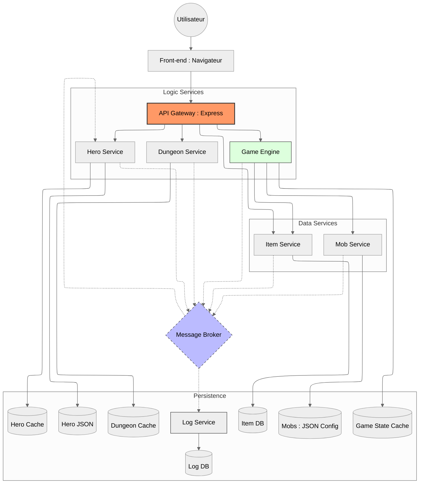

# Micro-Donjon - Architecture Microservices

> Célian Chausson, Irwin Ladrette, Nils Saadi - INFRES 17 DL

## Sujet

Micro-Donjon est un jeu RPG textuel sur navigateur, basé sur une architecture microservices. L'utilisateur peut créer des héros, explorer des donjons générés dynamiquement, combattre des monstres, collecter des items et suivre ses actions via un système de logs.

### Fonctionnalités principales

- Création et gestion de héros (PV, niveau, caractéristiques, inventaire, or)
- Exploration de donjons générés à l'entrée
- Déplacement dans le donjon, combats aléatoires par case
- Système de logs passif pour suivre toutes les actions
- Utilisation de plusieurs bases de données (PostgreSQL, JSON/Cache)
- Frontend Vue.js pour l'interface utilisateur

## Structure du Projet

```
Micro-Donjon/
├── AuthService/        # Authentification, gestion utilisateurs, JWT
├── DungeonService/     # Génération et gestion des donjons
├── HeroService/        # CRUD héros, inventaire, effets d'items
├── ItemService/        # CRUD items, génération aléatoire
├── MobService/         # CRUD monstres, filtrage par type
├── GameEngine/         # Logique du jeu, combats, gestion du state
├── LogService/         # Service de logs passif (RabbitMQ + PostgreSQL)
├── Gateway/            # API Gateway (proxy, sécurité, documentation)
├── Front/              # Frontend Vue.js
├── docker-compose.yaml # Orchestration des services
└── README.md           # Ce fichier
```

## Démarrage Rapide

### Prérequis

- Node.js (>= 18)
- Docker & Docker Compose
- RabbitMQ, PostgreSQL

### Installation

1. Cloner le repo :
   ```sh
   git clone https://github.com/18Nilsou/Micro-Donjon
   cd Micro-Donjon
   ```

2. Lancer tous les services :
   ```sh
   docker-compose up --build
   ```

3. Accéder à l'application :
   - Frontend : [http://localhost:8080](http://localhost:5173)
   - Gateway/API : [http://localhost:3000](http://localhost:3000)
   - Documentation Swagger : [http://localhost:3000/docs](http://localhost:3000/docs)
   - Logs : [http://localhost:3005/logs](http://localhost:3005/logs)

## Description des Microservices

### AuthService
- Inscription, connexion, gestion JWT
- Association héros/utilisateur
- Stockage utilisateurs en base relationnelle Maria DB

### HeroService
- CRUD héros, inventaire, effets d'items
- Stockage des héros en JSON/Cache (Redis)
- Gestion des classes, stats, inventaire

### DungeonService
- Génération aléatoire de donjons
- Stockage des donjons en cache (Redis)
- Gestion des salles, entrées/sorties, dimensions

### ItemService
- CRUD items, génération aléatoire
- Stockage items dans un JSON
- Gestion des effets et types d'items

### MobService
- CRUD monstres, filtrage par type (Common/Boss)
- Stockage monstres en JSON

### GameEngine
- Logique du jeu, combats, gestion du state
- Orchestration des actions, gestion du tour, résolution des combats

### LogService
- Enregistrement passif des événements via RabbitMQ
- Stockage des logs en PostgreSQL
- API pour consulter les logs, statistiques, logs par héros

### Gateway
- Proxy centralisé pour toutes les routes API
- Sécurité, documentation Swagger, gestion des tokens

### Front
- Interface utilisateur Vue.js
- Gestion de l'authentification, sélection du héros, exploration du donjon, combats

## Architecture technique

- **Node.js/Express/TypeScript** pour les microservices backend
- **Vue.js** pour le frontend
- **RabbitMQ** pour la communication asynchrone (broker)
- **PostgreSQL** pour les logs et certains services
- **MariaBD** pour les utilisateurs
- **Redis/JSON** pour le cache et stockage rapide
- **Docker Compose** pour l'orchestration

## Communication & Queues

- Les services publient des événements (logs, mises à jour) dans RabbitMQ
- LogService consomme tous les messages et les stocke en base
- Les autres services ne communiquent pas directement avec LogService

## Bases de données

- **PostgreSQL** : Logs, items
- **MariaDB** : User
- **Redis/JSON** : Héros, donjons, mobs, game state

## Documentation API

Chaque service expose sa documentation via Swagger :
- `/docs` sur chaque microservice
- Fichiers OpenAPI (`openapi.yaml/yml`) dans chaque dossier

## Tests

- Tests unitaires et intégration :  
  ```sh
  ./run-all-tests.sh
  ```
- Tests API (Bruno) :  
  ```sh
  bru run <service>/bruno
  ```

## Monitoring

- Endpoint `/health` sur chaque service
- LogService expose l'état RabbitMQ/PostgreSQL

## Diagramme d'Architecture

